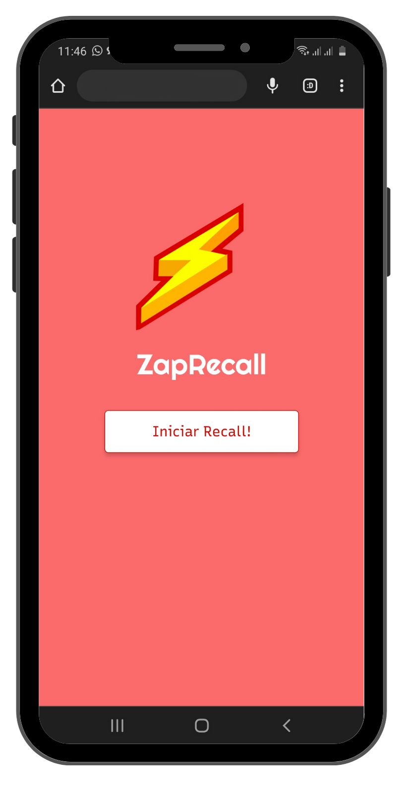
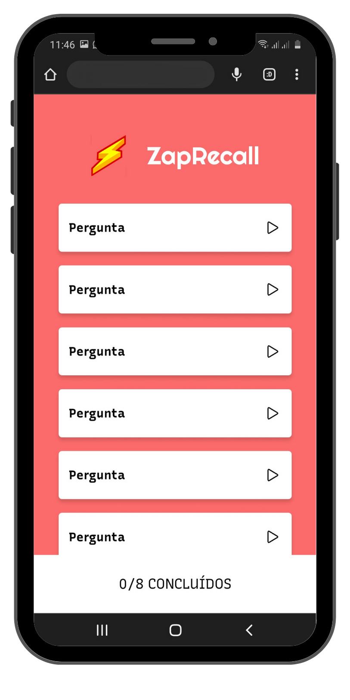

# Projeto ZapRecall 

## Descrição do Projeto
 O ZapRecall foi o segundo projeto que desenvolvi no curso da Driven Education, usando a biblioteca React.js. Ele é um app de flashcards que são cartões que contém uma pergunta na frente e a resposta atrás.
O Objetivo é ler a pergunta e tentar lembrar da resposta antes de virar o cartão, se você conseguir acertar da um "Zap!", caso contrário , você clica em "Não lembrei" ou "Quase esqueci".

